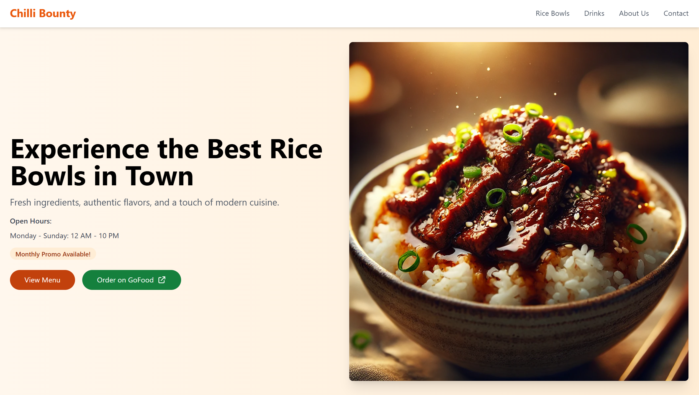

## 🖼️ Project Preview

[](https://andikasafri.site/)

Click the image above to view the live website!

---

## 👋 Introduction

**Name**: Andika Safri  
**Batch**: RevoU FSSE OCT 2024  
**Project Name**: Project Milestone 1

Hi, I'm Andika Safri. I am thrilled to present my latest project—**Chilli Bounty**, a dynamic and appetizing website for a modern food stall specializing in delectable Rice Bowls and refreshing beverages.

📧Connect with me:

[](https://www.linkedin.com/in/andika-safri/)
[](https://www.instagram.com/dikko_pujangga/)
[](mailto:andika.saf3@gmail.com)

---

## 🌐 Website Structure and Development Stages

**Screenshot**:  


### Breakdown of Stages:

1. **Initial HTML Structure**

   - Bare-bones structure created using semantic HTML.
   - Content hierarchy established with headings, navigation, and placeholders.

2. **Adding CSS and Styling**

   - Tailwind CSS implemented for rapid customization and modern, clean design.
   - Focused on an appetizing color palette of warm orange and neutral grays.

3. **Responsive Design Views**
   - Mobile-first design approach ensures smooth experiences on all devices.
   - Layout dynamically adjusts using Tailwind's grid system.

---

##  Deployment Process on Netlify

**Screenshot**:  


### Steps:

1. **Click "Add new site"** and select **Import an existing project**.
2. Choose **GitHub** as the source platform.
3. **Authorize GitHub account access** to connect repositories.
4. **Select the repository** containing your project.
5. Pick a site name, verify its availability, and click **Deploy**.

---

## Steps to Add a Custom Domain

**Screenshot**:  


### Steps:

1. Navigate to **Production Domains** in Netlify, then click **Add a domain**.
2. Input your custom domain name and click **Verify**.
3. Once verified, click **Add Domain**.
4. Update **Nameserver settings** in your domain hosting panel according to Netlify's instructions.

---

## 🚀 Project Setup Instructions

### Prerequisites

- **Node.js** (version 14 or higher)
- **npm** (Node Package Manager)

### 🛠 Installation Steps

1. Clone the repository:

   ```bash
   git clone https://github.com/revou-fsse-oct24/milestone-1-andikasafri.git
   ```

2. Navigate to the project directory:
   ```
   cd chilli-bounty
   ```
3. Install dependencies:
   ```
   npm install
   ```
4. Run the development server:
   ```
   npm run dev
   ```
5. Build for production:
   ```
   npm run build
   ```

---

## 📦 Dependencies and Libraries

- **Tailwind CSS**

  - For rapid development and responsive design.
  - Chosen for its lightweight, customizable nature.

- **HTML5**

  - Used for structuring content semantically.

- **JavaScript (Vanilla)**
  - Implements interactivity such as menu toggles, scroll animations, and form handling.

---

## 🎨 Design Choices and Considerations

- **Color Palette**:

  - Primary: Warm Orange (energetic, appetizing).
  - Neutral: Whites and Grays (modern, clean).

- **Typography**:

  - Clean, readable fonts for effortless scanning.

- **Responsive Layout**:

  - Built with a mobile-first approach to ensure an excellent experience on all devices.

- **Interactions**:
  - Smooth scrolling and hover effects enhance user engagement.

---

## 🔒 Performance and Security

- **Optimized Images**:

  - Compressed and converted to WebP format.

- **Minimal JavaScript**:

  - Lightweight, without heavy frameworks.

- **Security Considerations**:
  - HTTPS implemented for secure hosting.
  - Input validation ensures robust form handling.

---

## 📧 Contact

[](https://www.linkedin.com/in/andika-safri/)
[](https://www.instagram.com/dikko_pujangga/)
[](mailto:andika.saf3@gmail.com)
